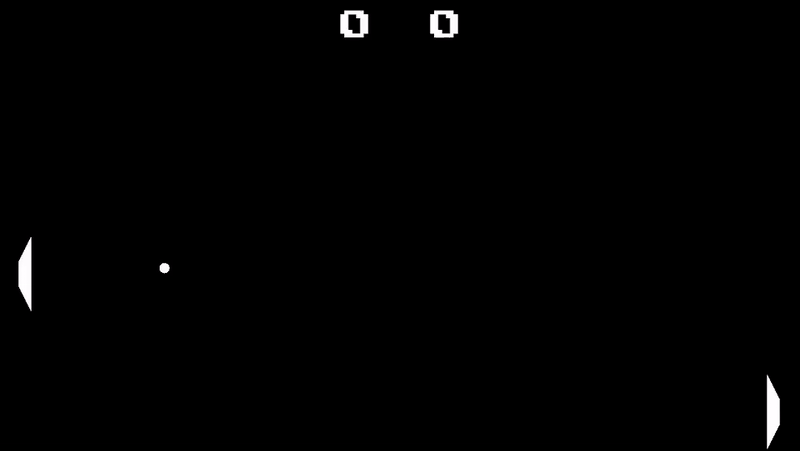

# Pong

Simple Pong clone written in C++ using SFML 2.6.

---

### Demo

---

## Controls
There is a config file to change colors of the game.  
In singleplayer player moves with `W`/`S` or `Up`/`Down` keys.  
In 2-players mode left player uses `W`/`S`, while right uses `Up`/`Down`.  
Player can also pause the game with `Esc`.
